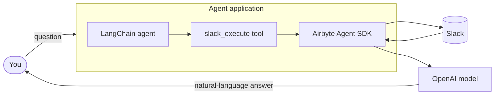

# LangChain Agent with Airbyte

This quickstart builds a conversational [LangChain](https://docs.langchain.com/) agent backed by the [Airbyte Agent SDK](https://docs.airbyte.com/). The agent uses an OpenAI model to reason and answer questions, and reaches into **Slack** through a single Airbyte-managed tool.

Ask it questions in plain English (e.g. *"List the files I modified in May 2026."*) and it will call the right Slack operations to answer.

## How It Works



- [`agent.py`](agent.py) wires everything together. `connect("slack")` returns an Airbyte-managed Slack connector, which is exposed to the model as the `slack_execute` tool via `SlackConnector.tool_utils`. `create_agent` binds that tool to a `ChatOpenAI` model with a short system prompt.
- [`main.py`](main.py) provides an interactive chat loop that keeps conversation history so you can ask follow-up questions.

The model decides when to call `slack_execute(entity, action, params)`. The Airbyte SDK handles Slack authentication, request building, and the actual API calls, returning structured data the model turns into an answer.

## Prerequisites

### Airbyte

The Airbyte Agent SDK uses your Airbyte Cloud credentials to run connector operations. You'll need:

- An Airbyte Cloud account with a **Slack** source configured. See the [Slack source docs](https://docs.airbyte.com/integrations/sources/slack) for setup.
- An Airbyte API application to obtain a **Client ID** and **Client Secret**. Create one in the Airbyte Cloud UI under **Settings → Applications**.

### OpenAI

The agent uses an OpenAI model (`gpt-4o`) for reasoning and response generation. You'll need an OpenAI account with credits and an API key — generate one at [platform.openai.com/api-keys](https://platform.openai.com/api-keys).

### Software

- **Python 3.10 or later** — download from [python.org](https://www.python.org/downloads/) if needed.
- **[uv](https://docs.astral.sh/uv/)** — used to manage the virtual environment and dependencies. Install with `curl -LsSf https://astral.sh/uv/install.sh | sh`.

## 1. Clone the Repository

Clone only this quickstart:

```bash
git clone --filter=blob:none --sparse https://github.com/airbytehq/quickstarts.git
cd quickstarts
git sparse-checkout set airbyte_agents_quickstarts/langchain-agent
cd airbyte_agents_quickstarts/langchain-agent
```

## 2. Install Dependencies

`uv` reads [`pyproject.toml`](pyproject.toml) and creates an isolated environment with the locked dependencies:

```bash
uv sync
```

This installs `langchain`, `langchain-openai`, and `airbyte-agent-sdk`.

## 3. Add Configuration Values

Create a `.env` file in the project root with your credentials:

```bash
AIRBYTE_CLIENT_ID=your_airbyte_client_id
AIRBYTE_CLIENT_SECRET=your_airbyte_client_secret
OPENAI_API_KEY=your_openai_api_key
```

These are loaded automatically at startup via `python-dotenv`. The `.env` file is gitignored, so your secrets stay local.

## 4. Run the Agent

Start the interactive chat loop:

```bash
uv run main.py
```

You'll see:

```
Drive Agent Ready! Ask questions about Slack.
Type 'quit' to exit.

You:
```

Ask anything about your Slack workspace. Type `quit`, `exit`, or `q` to stop.

To run the one-off demo prompt instead of the chat loop:

```bash
uv run agent.py
```

## 5. Next Steps

- **Customize the system prompt** in [`agent.py`](agent.py) to shape the agent's tone or scope.
- **Add more connectors** by installing the Airbyte connector from the Python SDK, calling `connect("<connector>")`, and exposing them as additional tools. The agent can use several at once.
- **Swap the model** by changing the `ChatOpenAI(model=...)` argument, or wire in a different LangChain chat model.
- **Tune behavior** by adjusting the `temperature` or extending the conversation handling in [`main.py`](main.py).

## Resources

- [Airbyte Agent SDK documentation](https://docs.airbyte.com/)
- [LangChain documentation](https://docs.langchain.com/)
- [Airbyte Slack source connector](https://docs.airbyte.com/integrations/sources/slack)
